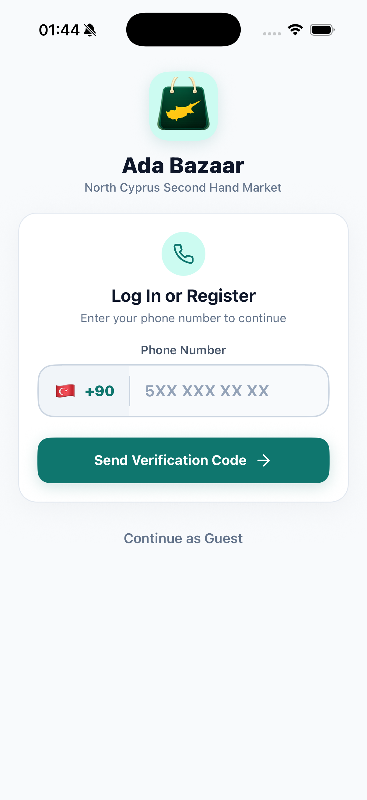
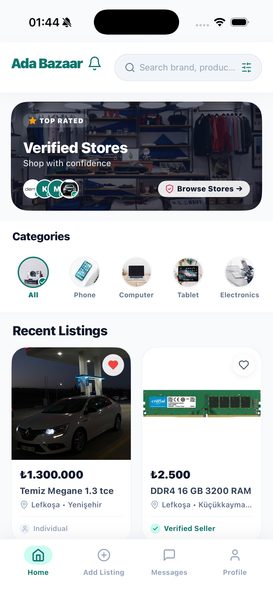
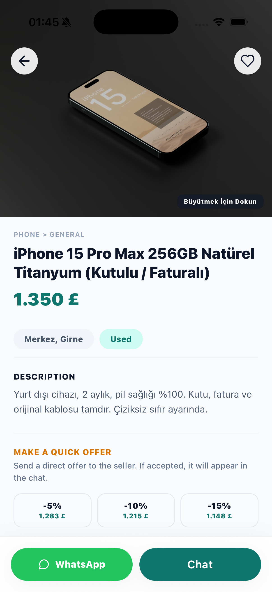
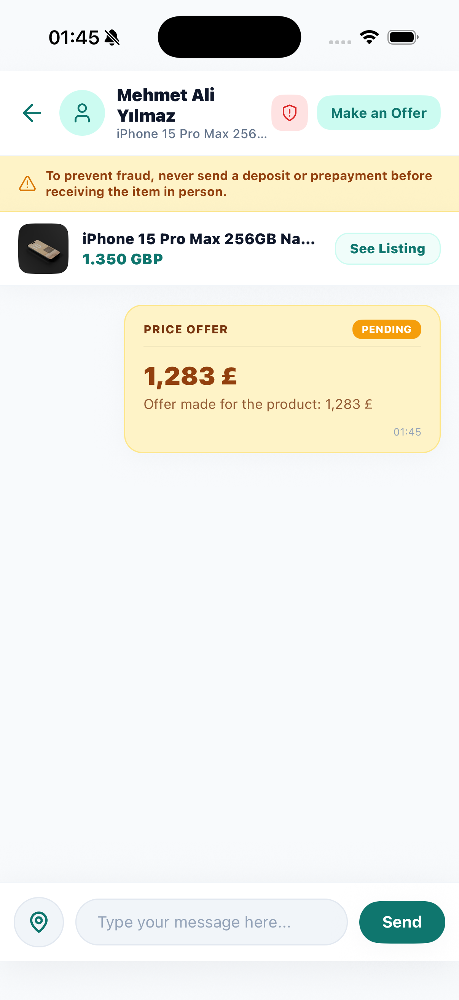
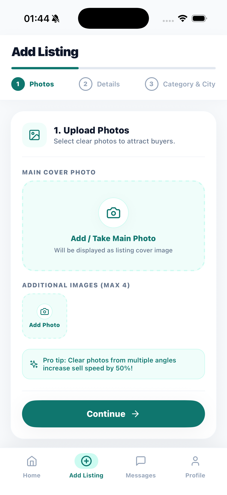
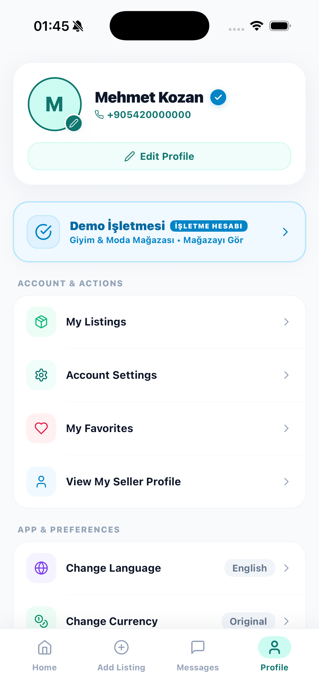

  

<h1 align="center">AdaBazaar</h1>

  <b>A Cross-Platform Mobile & Web Marketplace Application</b>

  
  
  
  
  
  

---

## Overview

**AdaBazaar** is a production-grade, multi-platform marketplace application engineered to connect buyers and sellers seamlessly. Built with high performance, scalability, and user experience at its core, AdaBazaar offers comprehensive classifieds management across mobile (iOS & Android) and web platforms.

The application features real-time synchronization, intelligent location filtering, multi-currency support, in-app buyer-seller price negotiations, and cloud media management.

---

## Core Features

- **Authentication & Security**: Secure user authentication powered by Firebase Auth, supporting phone verification, social sign-in, and role-based access control (User, Premium Seller, Admin).
- **Marketplace & Classifieds**: Multi-category support including Electronics, Vehicles, Real Estate, and Student essentials with dynamic multi-currency pricing (TRY, GBP, USD, EUR).
- **Real-Time Messaging & Negotiations**: Integrated buyer-seller chat system with real-time price offer submission, acceptance, and direct negotiation chips.
- **Regional & Category Filtering**: Granular location filtering across districts and cities with responsive category browsing.
- **Multilingual Support**: Built-in Turkish (TR) and English (EN) internationalization (`i18n`).
- **Push Notifications**: Real-time push notifications powered by Firebase Cloud Messaging (FCM) for message alerts, offer updates, and listing status changes.
- **Cloud Infrastructure**: Hybrid cloud architecture leveraging Firebase Firestore for real-time NoSQL data synchronization and Supabase CDN for fast media storage.

---

## Tech Stack

| Domain | Technology | Description |
| :--- | :--- | :--- |
| **Mobile App** | React Native, TypeScript, Redux Toolkit, Expo | Cross-platform mobile client with native performance |
| **Web App** | Next.js (App Router), TailwindCSS, i18n | Responsive web client with SSR and SEO optimization |
| **Backend API** | NestJS, Node.js, Firebase Admin SDK | Enterprise REST API and business logic orchestration |
| **Database** | Firebase Firestore | NoSQL document database with real-time listeners |
| **Storage** | Supabase Storage | Object storage and global CDN delivery for media assets |
| **Push Service** | Firebase Cloud Messaging (FCM) | Reliable cross-platform messaging service |

---

## Application Showcase

<table align="center">
  <tr>
    <td align="center" width="33%">
      
       
      <b>01. Authentication & Guest Entry</b>
    </td>
    <td align="center" width="33%">
      
       
      <b>02. Home Feed & Categories</b>
    </td>
    <td align="center" width="33%">
      
       
      <b>03. Product Details & Offers</b>
    </td>
  </tr>
  <tr>
    <td align="center" width="33%">
      
       
      <b>04. Real-Time Chat & Offers</b>
    </td>
    <td align="center" width="33%">
      
       
      <b>05. Create New Listing</b>
    </td>
    <td align="center" width="33%">
      
       
      <b>06. User Profile & Settings</b>
    </td>
  </tr>
</table>

---

## Availability

- **App Store**: *(Private Distribution / Production)*
- **Google Play**: *(Private Distribution / Production)*

---

## Repository Topics

`react-native` • `typescript` • `firebase` • `ios` • `android` • `mobile` • `marketplace` • `nextjs` • `nestjs` • `expo` • `supabase`

---

## Source Code Notice

> [!NOTE]
> The source code is private because this is a production application.  
> This repository serves as a technical showcase of the application architecture, UI design, and feature set.

---

## License

This repository is licensed under the [MIT License](./LICENSE).
