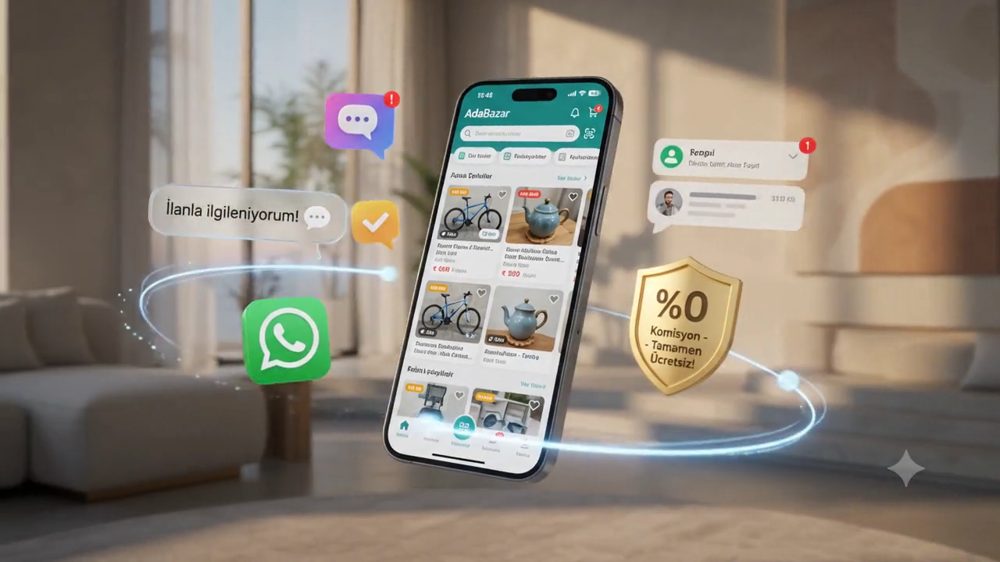
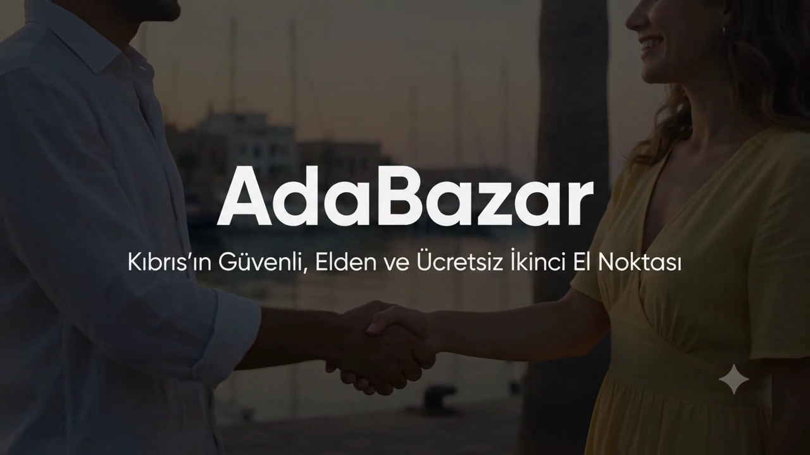

  

<h1 align="center">📱 AdaBazaar (Kıbrıs Market)</h1>

  <b>A modern cross-platform marketplace mobile & web application designed for Northern Cyprus (KKTC).</b>

  
  
  
  
  
  

  

---

## 📸 Screenshots

  
  
  
  

---

## 🚀 Features

- 🔐 **Secure Authentication**: Firebase Auth integration supporting email, phone, and social login with role-based permissions.
- 🛍️ **Marketplace & Classifieds**: Comprehensive categories (Second-hand, Vehicles, Real Estate, Student essentials) supporting multi-currency pricing (TRY, USD, EUR, GBP).
- 💬 **Real-Time Messaging & Negotiation**: Instant buyer-seller chat with built-in price offer and negotiation mechanisms.
- 📍 **Location-Based Filtering**: Search listings filtered by districts across Northern Cyprus (Girne, Lefkoşa, Gazimağusa, İskele, Güzelyurt, Lefke).
- 🌐 **Multilingual Support (TR/EN)**: Native Turkish and English language switching.
- 🔔 **Push Notifications**: Real-time Firebase Cloud Messaging (FCM) alerts for new messages, price drops, and announcements.
- 🌙 **Dark & Light Themes**: Dynamic responsive UI designed with modern glassmorphism aesthetic.
- ⚡ **High Performance Architecture**: Real-time Firestore synchronization and Supabase CDN storage.

---

## 🛠 Tech Stack

- **Mobile App**: React Native, TypeScript, Redux Toolkit, Expo
- **Web App**: Next.js (App Router), TailwindCSS, i18n
- **Backend API**: NestJS, Node.js, Firebase Admin SDK
- **Database & Storage**: Firebase Firestore (NoSQL), Supabase Storage
- **Push Notifications**: Firebase Cloud Messaging (FCM)

---

## 📲 Available On

- 🍎 **App Store**: *(Private Distribution / Coming Soon)*
- 🤖 **Google Play**: *(Private Distribution / Coming Soon)*

---

## 🏷️ Repository Topics

Recommended GitHub topics for this project:
`react-native` • `typescript` • `firebase` • `ios` • `android` • `mobile` • `marketplace` • `nextjs` • `nestjs` • `expo`

---

## ℹ️ Source Code Notice

> [!NOTE]
> The source code is private because this is a production application.  
> This repository showcases the application architecture, UI design, and feature set.

---

## 📄 License

This repository is licensed under the [MIT License](./LICENSE).
